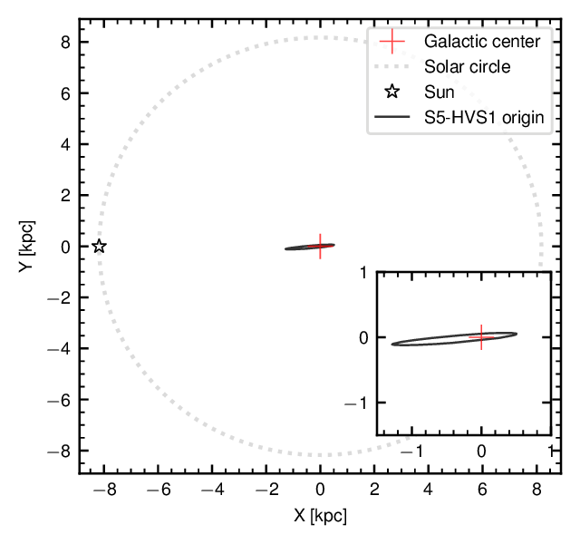

## The materials for the press-release on the discovery of the hyper-velocity star S5-HVS1 

The article "Discovery of a nearby 1700 km/s star ejected from the Milky Way by Sgr A*" by Sergey Koposov and collaborators was published in Monthly Notices of Royal Astronomical Society and is available [here](https://academic.oup.com/mnras/advance-article/doi/10.1093/mnras/stz3081/5612212) on the Oxford University Press website. 

## Links: 
- [The S5 collaboration](https://s5collab.github.io/)
- [The Anglo-Australian telescope](https://www.aao.gov.au/about-us/anglo-australian-telescope)
- [The Gaia satellite](https://sci.esa.int/web/gaia)
- [Homepage of Sergey Koposov](https://www.andrew.cmu.edu/user/skoposov/)
- [Homepage of Ting Li](https://sazabi4.github.io/)
- [Homepage of Douglas Boubert](https://www.douglasboubert.com/)

## Images:

All the images and videos are available in high resolution to download [here](images_videos/)

Caption: The location of the star on the sky and the direction of its motion. The star is flying away from the Galactic center, from which it was ejected 5 million years ago. Credit: Sergey Koposov [Download](images_videos/map.png)

---

Caption: An artist’s impression of S5-HVS1’s ejection by Sagittarius A*, the black hole at the center of the Galaxy. The black hole and the captured binary partner to S5-HVS1 are seen far away in the left corner of the picture, while S5-HVS1 is in the foreground, speeding away from them. Credit: James Josephides (Swinburne Astronomy Productions) [Download](images_videos/HyperVelocityStar2.jpg)

---

Caption: 
The precise orbit of S5-HVS1 allows scientists to determine where in the Galaxy the star originates. The red elongated contour shows the region in the Milky Way disk where (with high probability) the star originated.  This region is exactly where the center of the Galaxy and Sagittarius A*, the supermassive black hole, is located (shown by a black circle).  This shows, with high confidence, that the star was ejected by the black hole. The location of the Sun is also indicated by black star. Credit: Sergey Koposov [Download](images_videos/fine_tuning.png)

---
## Videos

Caption: The artist impression of the ejection mechanism by the supermassive black hole. Credit: James Josephides (Swinburne Astronomy Productions) [Download](images_videos/hyper velocity star animation.mp4)

 

The video shows the motion of two stars as they orbit each other, as they approach the black hole, and then -- when the black hole comes close enough -- the binary system is destroyed and one of the stars (red one) is captured by the black hole, while the blue one is ejected with high speed. Credit: Sergey Koposov [Download](images_videos/binary_stars_black_hole.mp4)

The view of the ejection of the S5-HVS1 star, as an observer from outside our galaxy would see it. The Sun is marked by an orange sphere, while the ejected star is shown by a blue sphere. Credit: Sergey Koposov [Download](images_videos/star_ejection.avi)

