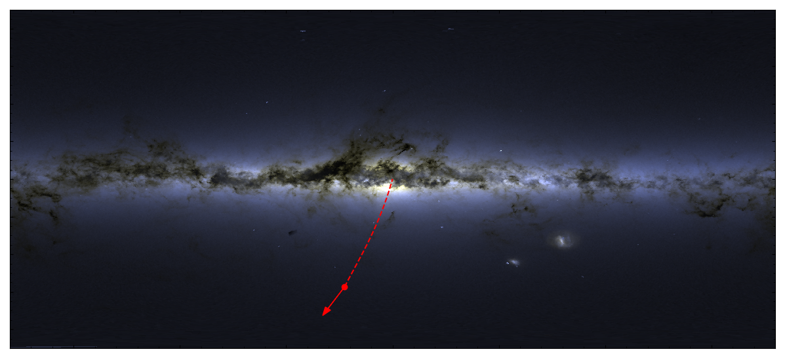
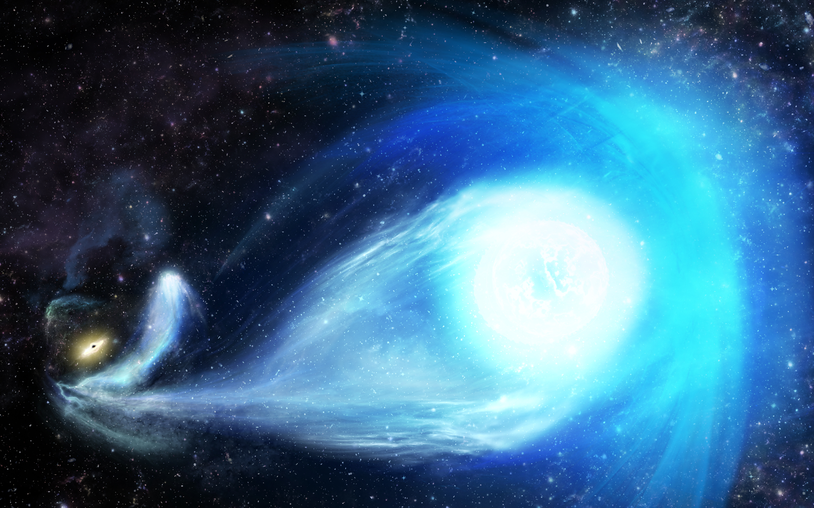

## The materials for the press-release on the discovery of the hyper-velocity star S5-HVS1 

The article "Discovery of a nearby 1700 km/s star ejected from the Milky Way by Sgr A*" by Sergey Koposov and collaborators was published in Monthly Notices of Royal Astronomical Society and is available [here](https://academic.oup.com/mnras/advance-article/doi/10.1093/mnras/stz3081/5612212) on the Oxford University Press website. 

Images:

Caption: The location of the star on the sky and the direction of its motion. The star is flying away from the Galactic center, from which it was ejected 5 million years ago. Credit: Sergey Koposov

Caption: An artist’s impression of S5-HVS1’s ejection by Sagittarius A*, the black hole at the center of the Galaxy. The black hole and the captured binary partner to S5-HVS1 are seen far away in the left corner of the picture, while S5-HVS1 is in the foreground, speeding away from them. Credit: James Josephides (Swinburne Astronomy Productions)

 
<a href="http://www.youtube.com/watch?feature=player_embedded&v=V91iH6i-9-g" 
target="_blank">here</a>
The view of the ejection of the S5-HVS1 star, as an observer from outside our galaxy would see it. The Sun is marked by an orange sphere, while the ejected star is shown by a blue sphere. Credit: Sergey Koposov (CMU)

